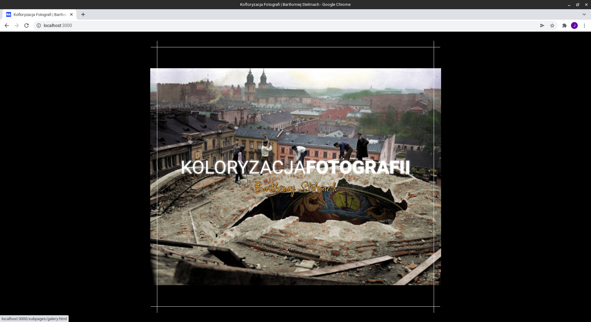
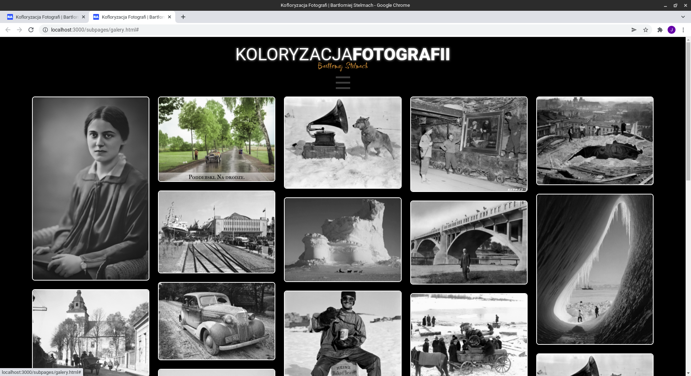
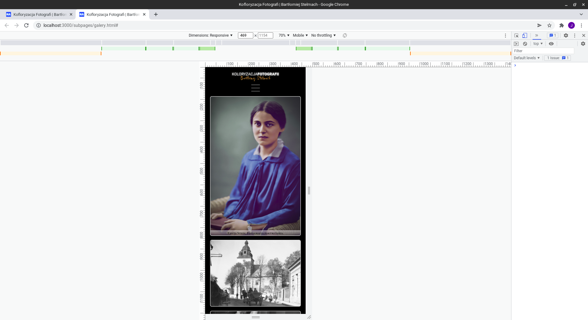

# KoloryzacjaFotografii
> Simple, responsive gallery design for BW photo colorist.  

> Live demo [_here_](https://jacpolanski.github.io/KoloryzacjaFotografii/)

## Table of Contents
* [General Info](#general-information)
* [Technologies Used](#technologies-used)
* [Screenshots](#screenshots)
* [Setup](#setup)
* [Project Status](#project-status)
* [Room for Improvement](#room-for-improvement)
* [Contact](#contact)

## General Information
- Project created for friends use, in bootcamp learning process
- Purpose was to learn how to build responsive, transition/animation filled gallery for creative persons

## Technologies Used
- HTML
- SCSS

## Screenshots

## Setup
- download or clone repository / `git clone repo_address`
- install dependencies / `npm install`
- start by `gulp`

## Project Status
Project is: _no longer being worked on_. Assumed learning task completed.

## Room for Improvement
Plenty :)

## Contact
Created by [_jac.polanski_](https://www.linkedin.com/in/polanski-jacek/) - feel free to contact me!
